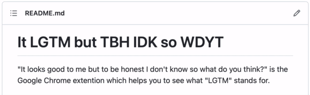

# 

"It looks good to me but to be honest I don't know so what do you think?" is the Google Chrome extention which helps you to see what "LGTM" stands for.



## Development

### Initial setup

```
$ git config --local core.hooksPath .githooks
$ chmod +x .githooks/*
```
